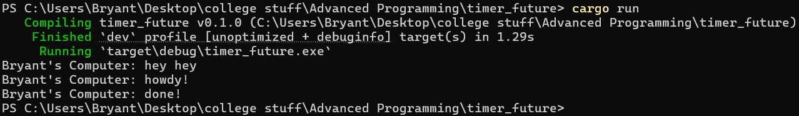
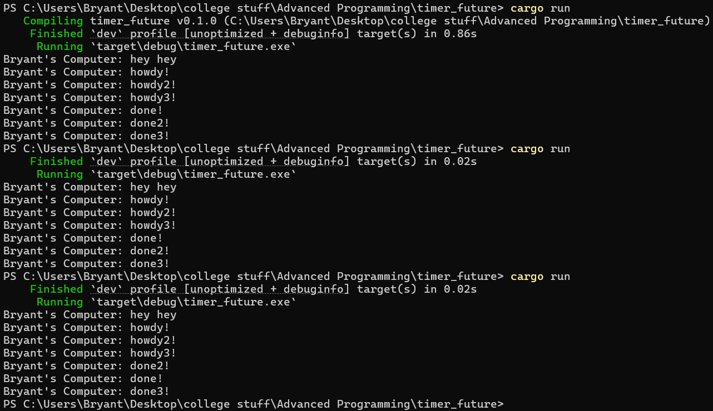
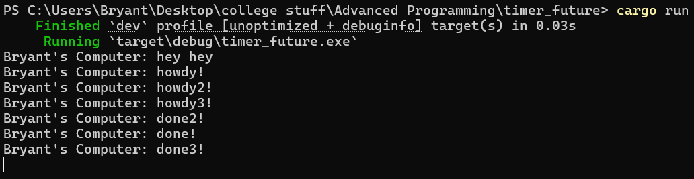

# Module 10, Tutorial 1
## 1.2 Understanding how it works

The program first sets up a task queue with a sender (spawner, that creates new tasks) and a receiver (executor, that runs tasks). The next lines spawn an asynchronous task that prints "Bryant's Computer: howdy!", then waits 2 seconds using a custom future (called `TimerFuture`), and finally prints "Bryant's Computer: done!". This future is boxed and sent into the task queue via `Spawner`. Before running the executor, the print statement prints "Bryant's Computer: hey hey" immediately into the console before the other two messages (this is on the main thread still running synchronously).

After that, the spawner is dropped, telling the executor that there are no more tasks to be sent. This allows the executor to eventually exit the loop when all tasks are done. Finally, the line `executor.run();` will start the main task execution loop. It takes the tasks from the queue and runs them as part of their logic.

## 1.3 Multiple Spawn and removing drop
With `drop(spawner);`:

Without `drop(spanwer);`:

The "hey hey" message was ran first because this is still part of the main (synchronous) thread. After that, the program ran all the three asynchronous threads at the same time. First, the three "howdy" messages will be printed out. The order is always the same: howdy, howdy1, and then howdy2. After 2 seconds, the three "done" messages will also be printed out at the same time, and this time, the order in which they appear is random. This is because the tasks are being added to the queue the same order they're spawned, so they initially execute tasks the order they were spawned. The statement `println!("Bryant's Computer: howdy!");` executes synchronously at the very start of each task. For the "done" messages, it happens after an `await`, which completes asynchronously. The wake-up order differs very slightly based on OS timing, thread scheduling, and other factors. When the timer completes, the task is woken up, but the order isn't strictly guaranteed.
